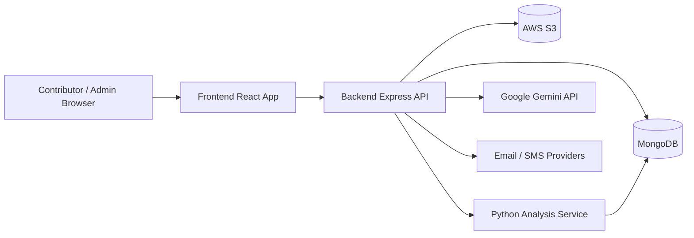
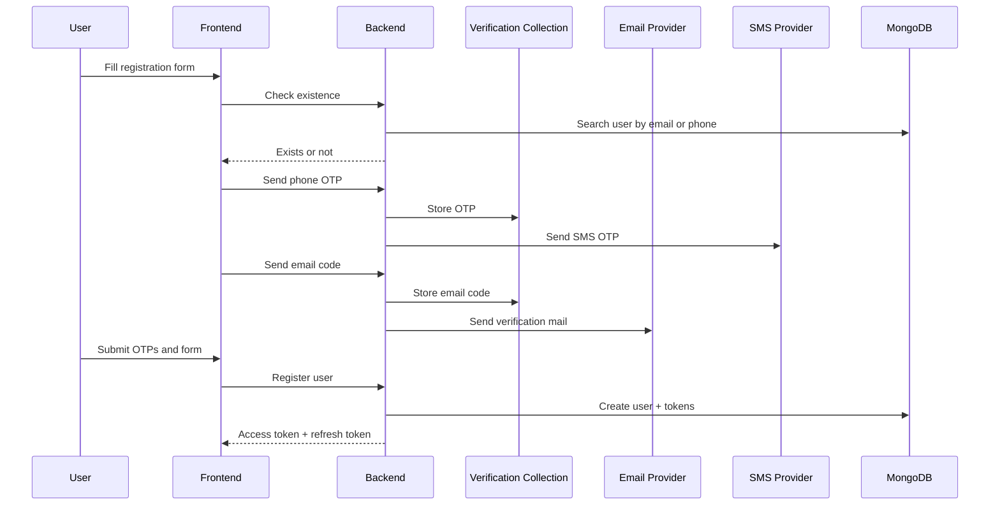
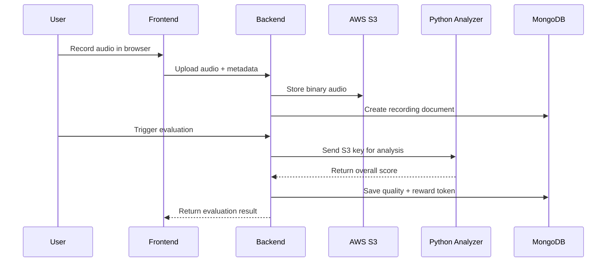

# TatvamAI Webtech

TatvamAI is a multilingual voice-data crowdsourcing platform built to collect, validate, evaluate, and reward user-recorded speech contributions.

This repository contains two major applications:

- `backend/` - an Express + MongoDB API that handles authentication, user onboarding, recording ingestion, reward-token issuance, OTP verification, and admin workflows.
- `frontend/` - a Vite + React application that provides the public site, authentication flows, contributor dashboard, QR-based recording experience, profile management, and admin dashboard.

The system is designed around a simple principle:

1. A contributor signs up or signs in.
2. The user records speech for a selected language and domain.
3. The audio is uploaded to AWS S3.
4. An external Python analysis service evaluates the recording.
5. The backend converts the evaluation into a quality label and reward token amount.
6. The contributor sees the result in their dashboard.

The code in this repository implements the web platform and backend orchestration.

## What This Product Does

TatvamAI is built for dataset creation and contributor management in a voice-tech pipeline. It supports:

- user registration with email and phone verification
- phone OTP login and email/password login
- JWT-based session control
- protected contributor and admin dashboards
- voice recording capture in the browser
- paragraph generation for recording prompts
- AWS S3 storage for raw audio files
- asynchronous scoring through an external Python service
- reward token creation after evaluation
- admin oversight for users, recordings, and token statistics

## Technology Stack

### Frontend

- React 18
- TypeScript
- Vite
- React Router
- Tailwind CSS
- Framer Motion
- shadcn/ui and Radix UI primitives
- Axios
- RecordRTC
- jsQR for QR scanning
- React Webcam for camera access

### Backend

- Node.js
- Express 5
- MongoDB with Mongoose
- JWT authentication
- bcrypt password hashing
- Multer for file upload handling
- AWS SDK for S3 uploads
- Nodemailer for email verification codes
- SMS OTP integration through a Renflair endpoint
- Axios for calling external services

### External Services

- AWS S3 for raw audio storage
- MongoDB for application data
- A separate analysis API for recording evaluation
- Google Gemini API for paragraph generation
- Gmail SMTP for email verification
- Renflair SMS API for phone OTP delivery
- Optional serverless deployment surface for the Python analyzer if you host it on AWS Lambda or an equivalent platform

## Product Surfaces

### Public Site

- Home page
- Products page
- About pages
- Contact
- Blogs
- Careers
- FAQ
- Documentation
- Demo

### Contributor Flow

- sign up with identity and demographic details
- verify email and phone
- sign in using email/password or phone OTP
- open dashboard to inspect contribution history and token balance
- launch QR scanner or go directly to the recording flow
- record audio, preview it, and submit it for backend processing

### Admin Flow

- review all recordings
- evaluate pending recordings
- inspect platform statistics
- manage user list and admin dashboards

## Screenshots

The following screenshots highlight the public-facing platform experience.

### Homepage Hero


### Landing Page Overview


## System Architecture

The architecture is a classic split between a browser client, a Node.js API, cloud storage, and an external evaluation service.



### Design Principles

- The frontend never talks directly to MongoDB or S3.
- The backend owns identity, authorization, and data lifecycle decisions.
- Raw audio is treated as a binary asset and stored outside the database.
- The recording record in MongoDB is the source of truth for metadata.
- Evaluation is decoupled from upload so upload and scoring can evolve independently.

## End-to-End User Pipeline

### 1. Registration and Verification

The contributor signup flow is intentionally strict because the platform depends on clean contributor identity.

Frontend steps:

1. User opens the signup page.
2. User enters name, gender, date of birth, city, mother tongue, known languages, email, phone number, and password.
3. The frontend checks:
	 - password confirmation
	 - minimum password length
	 - phone number format
	 - age of at least 18
	 - whether the email or phone already exists
4. The user requests phone OTP verification.
5. The user requests email verification code.
6. The user enters both codes.
7. The user submits the registration form.

Backend behavior:

- `/api/v1/users/check-user-existence` verifies whether the email or phone already belongs to an account.
- `/api/v1/users/send-phone-otp-register` creates a temporary OTP record and sends the code through SMS.
- `/api/v1/users/verify-phone-otp` confirms the phone number.
- `/api/v1/users/send-verification-code` creates a temporary email code and sends it through Gmail SMTP.
- `/api/v1/users/verify-email-code` confirms the email address.
- `/api/v1/users/register` creates the account, hashes the password, marks both verification flags, and returns access and refresh tokens.

### 2. Authentication

The platform supports two login modes:

- Email + password
- Phone OTP login

On successful login, the backend issues:

- access token for API authorization
- refresh token for session renewal

The frontend maintains the authenticated session after login and automatically attaches credentials to protected API calls.

### 3. Contribution and Recording Flow

The contribution experience is the main product loop.

Frontend steps:

1. The contributor opens the QR or recording flow.
2. The system may generate a paragraph based on selected language and domain.
3. The contributor records the prompt in the browser using microphone access.
4. The recording can be paused, resumed, stopped, and reviewed.
5. The user submits the audio file together with metadata such as language, dialect, domain, duration, and recording source.

Backend steps:

- The file is received through Multer as an in-memory upload.
- The binary audio is sent to AWS S3.
- A `Recording` document is created in MongoDB with the S3 URL and metadata.
- Later, the recording is evaluated and a `RewardToken` document is created.

### 4. Evaluation and Rewarding

When a recording is evaluated, the backend:

1. Loads the recording from MongoDB.
2. Resolves the S3 key from the stored recording URL.
3. Sends the S3 key to the external Python analysis service.
4. Receives the overall quality score.
5. Converts the score into one of the platform quality labels:
	 - excellent
	 - good
	 - average
	 - below_average
	 - poor
6. Assigns a reward amount using a randomized reward band.
7. Stores the quality on the recording document.
8. Creates a reward token record.
9. Increments the user reward balance.

This means the recording and reward documents are linked, and the dashboard can always reconstruct the contributor history from the database.

## Backend Architecture

### Server Bootstrap

- `backend/src/index.js` loads environment variables, connects to MongoDB, and starts the Express app.
- `backend/src/app.js` defines middleware, CORS behavior, route mounting, and the test endpoint.

### Route Groups

#### Health Check

- `GET /api/v1/healthcheck`

#### Users

- `POST /api/v1/users/register`
- `POST /api/v1/users/login`
- `POST /api/v1/users/logout`
- `POST /api/v1/users/refresh-token`
- `GET /api/v1/users/current`
- `GET /api/v1/users/recordings`
- `POST /api/v1/users/change-password`
- `PUT /api/v1/users/update-account`
- `GET /api/v1/users/contribution-stats`
- `GET /api/v1/users/incentives`
- `DELETE /api/v1/users/delete-account`
- `POST /api/v1/users/send-phone-otp-register`
- `POST /api/v1/users/verify-phone-otp`
- `POST /api/v1/users/send-phone-otp-login`
- `POST /api/v1/users/login-phone-otp`
- `POST /api/v1/users/send-verification-code`
- `POST /api/v1/users/verify-email-code`
- `POST /api/v1/users/check-user-existence`
- `GET /api/v1/users/admin/users`
- `GET /api/v1/users/admin/stats`

#### Recordings

- `POST /api/v1/recordings/`
- `POST /api/v1/recordings/:id/evaluate`
- `GET /api/v1/recordings/pending-evaluation`
- `GET /api/v1/recordings/admin`
- `GET /api/v1/recordings/admin/:id`
- `DELETE /api/v1/recordings/admin/:id`
- `POST /api/v1/recordings/admin/:id/evaluate`
- `POST /api/v1/recordings/generate-paragraph`

#### Reward Tokens

- `GET /api/v1/reward-tokens/`
- `GET /api/v1/reward-tokens/admin`
- `GET /api/v1/reward-tokens/stats`
- `GET /api/v1/reward-tokens/api/tokens/recording/:id`

### Authentication Model

Authentication is JWT-based.

- `verifyJWT` reads the token from the `Authorization` header or cookies.
- `authorizeRoles` restricts admin routes.
- Access tokens are short-lived.
- Refresh tokens are persisted in the user document.
- The frontend updates UI state through custom events after authentication changes.

### Data Storage Model

#### User

Core fields:

- name
- email
- phoneNo
- password
- role
- gender
- dob
- city
- motherTongue
- knownLanguages
- refreshToken
- recordings
- rewardTokens
- emailVerified
- phoneNoVerified

#### Recording

Core fields:

- userId
- recordingUrl
- language
- dialect
- domain
- duration
- recordedVia
- quality
- transcription

#### RewardToken

Core fields:

- userId
- recordingId
- final_quality
- amount
- reason
- status
- method

#### Verification

Used for temporary OTP and email verification codes.

### Important Backend Behaviors

- Audio uploads are stored in S3 under the `raw-audio/` prefix.
- The platform currently uses Renflair for SMS OTP delivery, even though an older utility also references 2Factor.
- Email verification uses Gmail SMTP through Nodemailer.
- Paragraph generation uses the Gemini API.
- The evaluation step is handled by a separate analysis service behind the backend orchestration layer.

## AWS Pipeline

TatvamAI’s infrastructure story is centered on a simple AWS pipeline: S3 stores the raw asset, Lambda-style compute evaluates or dispatches work, and MongoDB preserves the application state that ties everything together.

### Why S3 Matters

S3 is not just a file bucket in this system. It is the durable storage layer for contributor audio.

- Audio blobs stay outside MongoDB, which keeps the database lean and query-friendly.
- The recording document stores the S3 object URL, making metadata searchable without duplicating the file itself.
- S3 gives the platform durability, versioning options, lifecycle policies, and predictable scale for large audio datasets.
- Because raw voice data can grow quickly, external object storage avoids document-size pressure and keeps upload handling simpler.

### Why Lambda Matters

Lambda is the natural fit for the compute side of an event-driven audio pipeline.

- It lets the platform react to uploads or processing triggers without keeping servers hot all the time.
- It reduces the need for a permanently running worker fleet when evaluation can be broken into short-lived tasks.
- It fits the pattern of "upload once, process later," which is ideal for crowdsourced voice contributions.
- It helps isolate the scoring pipeline from the web API, so the core app can remain responsive while analysis happens asynchronously.

### Practical Implications

- Uploads should be treated as idempotent events because retries are normal in distributed pipelines.
- The API should never assume scoring is instantaneous; the user interface should be prepared for a pending state.
- S3 object naming should be deterministic enough to trace a recording, but not so brittle that it breaks future migrations.
- Lambda introduces cold starts, time limits, and memory constraints, so long-running transcription or analysis work should be split carefully.
- Any queue or event trigger around Lambda should account for duplicate delivery and retries.
- The database remains the source of truth for business state, while S3 remains the source of truth for the binary audio asset.

### Recommended AWS Mental Model

Think of the pipeline in three layers:

1. Ingress: browser upload reaches the backend.
2. Persistence: S3 stores the audio, MongoDB stores the record.
3. Processing: Lambda or external compute evaluates the file and writes the result back into the application model.

## Frontend Architecture

### Routing

The frontend uses React Router to separate public and protected experiences.

Public routes include:

- `/`
- `/products`
- `/dhvani-shilp`
- `/about`
- `/contact`
- `/blogs`
- `/demo`
- `/faq`
- `/docs`
- `/careers`
- `/about-tatvam`
- `/auth/signin`
- `/auth/signup`

Protected routes include:

- `/dashboard`
- `/admin`
- `/qr`
- `/qr-recording`
- `/profile`

### Frontend State and Session Handling

- `frontend/src/config/axios.ts` injects the access token into the `Authorization` header.
- A 401 response clears tokens and redirects the user to sign in.
- `frontend/src/utils/auth.ts` provides helpers to set, clear, and inspect tokens.
- `AuthContext` rehydrates the user from `/users/current` when a token exists.

### Main UI Flows

#### Home Page

- branding and product positioning
- call-to-action into the product ecosystem

#### Sign Up

- multi-step form
- phone OTP verification
- email verification code
- final account creation and automatic login

#### Sign In

- phone OTP login
- email/password login

#### Dashboard

- personal stats
- total recordings
- contribution time
- languages contributed
- total tokens
- paginated list of recordings

#### QR and Recording Pages

- QR scanner using webcam and jsQR
- contributor entry point into voice tasks
- microphone recording using RecordRTC
- prompt generation based on selected language and domain
- audio upload submission

#### Admin Dashboard

- platform-wide statistics
- all recordings list
- manual evaluation controls
- delete recording controls
- user lookup and administration

#### Profile

- current account data
- update account details
- change password
- logout
- delete account

## Request and Data Flow Diagrams

### Signup Flow



### Recording Flow



## Project Structure

```text
TatvamAI_Webtech/
├── backend/
│   ├── package.json
│   ├── public/
│   │   └── temp/
│   └── src/
│       ├── app.js
│       ├── constants.js
│       ├── index.js
│       ├── controllers/
│       │   ├── healthcheck.controller.js
│       │   ├── recording.controller.js
│       │   ├── rewardToken.controller.js
│       │   └── user.controller.js
│       ├── db/
│       │   └── dbConnect.js
│       ├── middlewares/
│       │   ├── auth.middleware.js
│       │   └── multer.middleware.js
│       ├── models/
│       │   ├── device.model.js
│       │   ├── recording.model.js
│       │   ├── rewardToken.model.js
│       │   ├── user.model.js
│       │   └── verification.model.js
│       ├── routes/
│       │   ├── healthcheck.routes.js
│       │   ├── recording.routes.js
│       │   ├── rewardToken.routes.js
│       │   └── user.routes.js
│       └── utils/
│           ├── ApiError.js
│           ├── ApiResponse.js
│           ├── asyncHandler.js
│           ├── aws_s3.js
│           ├── sendEmail.js
│           └── sendOtpSms.js
├── frontend/
│   ├── package.json
│   ├── bun.lockb
│   ├── index.html
│   ├── vite.config.ts
│   ├── tailwind.config.ts
│   ├── vercel.json
│   └── src/
│       ├── App.tsx
│       ├── App.css
│       ├── index.css
│       ├── main.tsx
│       ├── components/
│       ├── config/
│       ├── hooks/
│       ├── lib/
│       ├── pages/
│       ├── styles/
│       └── utils/
├── README.md
├── structure.txt
└── TatvamAI_Website_Content.txt
```

## Environment Variables

### Backend

Create a `backend/.env` file with the following values:

```env
PORT=8000
MONGODB_URI=mongodb+srv://<user>:<password>@<cluster>
ACCESS_TOKEN_SECRET=your_access_secret
ACCESS_TOKEN_EXPIRY=1d
REFRESH_TOKEN_SECRET=your_refresh_secret
REFRESH_TOKEN_EXPIRY=10d
AWS_ACCESS_KEY_ID=your_aws_key
AWS_SECRET_ACCESS_KEY=your_aws_secret
AWS_REGION=ap-south-1
AWS_S3_BUCKET=your-bucket-name
EMAIL_USER=your_gmail_address
EMAIL_PASS=your_gmail_app_password
RENFLAIR_API_KEY=your_sms_api_key
TWOFACTOR_API_KEY=legacy_optional_key
ADMIN_SECRET=your_admin_bootstrap_secret
GEMINI_API_KEY=your_gemini_api_key
PYTHON_SERVER_URL=https://your-python-service.example.com
```

Notes:

- `TWOFACTOR_API_KEY` appears in an older utility, but the current OTP code path uses Renflair.
- `PYTHON_SERVER_URL` must point to the external analyzer service that exposes `/analyze`.
- `ADMIN_SECRET` is used by the temporary admin bootstrap route.

### Frontend

The frontend currently points Axios at:

- production: `https://tatvamai-webtech.onrender.com`
- local fallback: `http://localhost:3000/api/v1`

If you move environments, update `frontend/src/config/axios.ts` accordingly.

## Local Development Setup

### Backend

```bash
cd backend
npm install
npm run dev
```

### Frontend

```bash
cd frontend
npm install
npm run dev
```

## Runtime Notes

- The backend serves static files from `backend/public`.
- Auth is token-based rather than cookie-based in the frontend state layer.
- The app uses CORS allowlisting for production and local development origins.
- Recording uploads rely on the browser granting microphone permission.
- QR scanning relies on webcam permission.
- Admin routes require both a valid JWT and the `admin` role.

## Deployment View

The operational deployment should be read as a separation of concerns:

- the frontend renders the contributor and admin experience
- the backend owns authentication, persistence, and orchestration
- S3 stores the audio payloads
- Lambda or external compute handles evaluation work
- MongoDB stores the canonical business state

That separation is what lets TatvamAI scale from a small pilot to a high-volume contributor platform without rewriting the entire product model.
